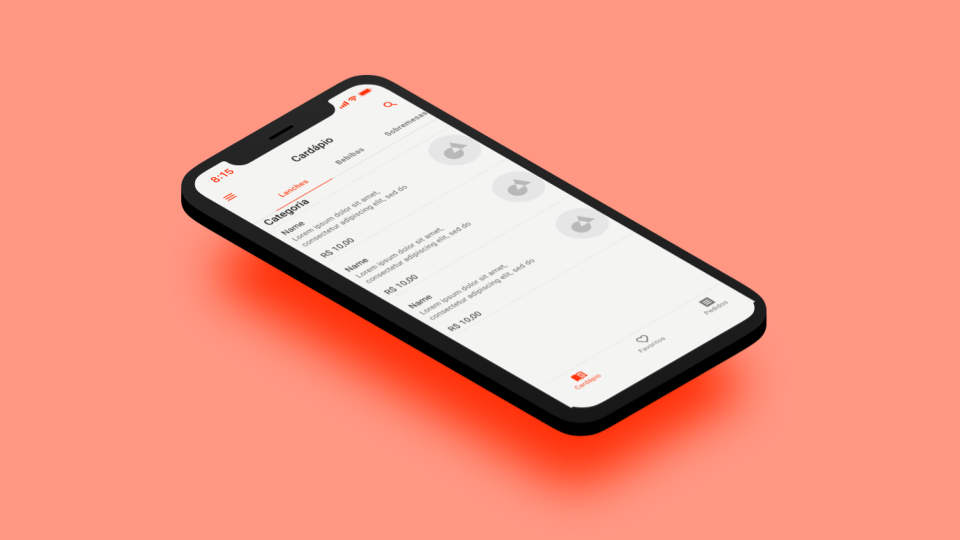

<h1 align="center">
    Vmenu
</h1>

  <a href="#rocket-tecnologias">Tecnologias</a>&nbsp;&nbsp;&nbsp;|&nbsp;&nbsp;&nbsp;
  <a href="#-projeto">Projeto</a>&nbsp;&nbsp;&nbsp;|&nbsp;&nbsp;&nbsp;
  <a href="#memo-licença">Licença</a>

 

  

## :rocket: Tecnologias

Esse projeto foi desenvolvido com as seguintes tecnologias:

- [reactjs](https://pt-br.reactjs.org/)
- [nextjs](https://nextjs.org/)
- [material-ui](https://reactjs.org)

## 💻 Projeto

O vmenu, é um cardápio virtual, em tempos de pandemia ele tem o objetico de manter o funcionamento dos restourantes maximizando o distanciamento social, segurança e ainda tornando o negócio mais eficiente, e empoderando o sesenvolvedor.

## :memo: Licença

Esse projeto está sob a licença MIT. Veja o arquivo [LICENSE](LICENSE.md) para mais detalhes.

---

Feito com ♥ by Vinicius :wave:
